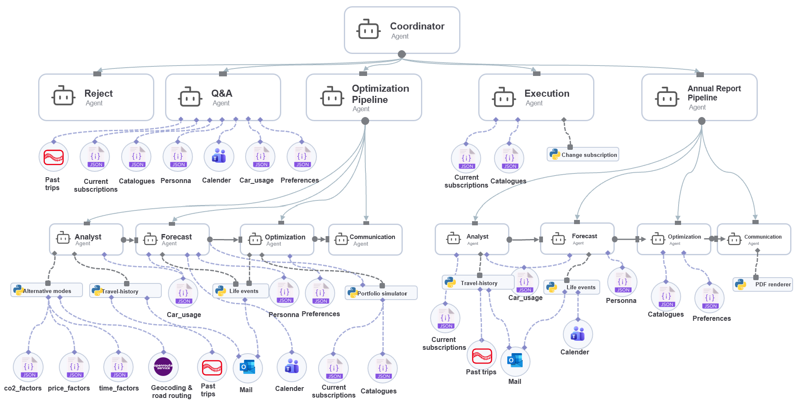

# Mobility Portfolio Advisor

<p align="center">
  
  
  
  
  
  
  
  
</p>

An agentic AI system prototype that answers one question: **“Is my mobility setup optimal right now?”**

Built for a joint course at **University of Cologne × Deutsche Bahn × BCG Platinion**.

Mobility subscriptions tend to accumulate: a rail pass, bus pass, leased car or car-sharing membership. Yet few people revisit whether their combination still fits their actual travel behaviour, preferences and life situation. The Mobility Portfolio Advisor reviews the current portfolio against present and anticipated demand, then recommends concrete changes with transparent cost, time and CO₂ trade-offs. 


## How it works

The product is a broader agent system, but its primary value path is a four-stage portfolio review that answers whether a user’s mobility setup is still optimal.

The central optimization pipeline is: **Analyst → Forecaster → Optimizer → Communicator**. Each stage combines a specialised LLM agent with deterministic services, receives deliberately scoped context and tools, and passes structured outputs to the next stage.

- **Analyst** — aggregates the user’s travel data and establishes a baseline mobility profile. It uses mode-substitution factor tables to simulate how observed journeys would compare with alternatives, for example, replacing car trips with rail, public transport, car sharing or other available modes.

- **Forecaster** — adjusts this baseline to anticipated future demand. It incorporates relevant calendar and email signals, such as an upcoming move or job change, to identify events that may reduce, expand or otherwise change future travel needs.

- **Optimizer** — combines predicted demand with the available subscription catalogue, prices and product rules. It evaluates possible portfolio combinations against the user’s preferences and identifies the best trade-off—for example, minimising cost, prioritising shorter travel times, reducing CO₂ emissions, or balancing all three.

- **Communicator** — translates the resulting analysis into a transparent, human-readable recommendation. It explains the proposed changes, expected impact and trade-offs, while leaving every contract change subject to explicit user approval.

<p align="center">
  
  <br>
  <sub><strong>Core optimization pipeline.</strong> The system’s primary decision-making path for portfolio reviews.</sub>
</p>

The optimization pipeline is only one route through the wider system. Other requests—such as a factual question, an explicit contract change or an annual report—do not need to run through the full four-stage review.

## Agent architecture

A **Coordinator** agent (`mobility_advisor/agent.py`) classifies each incoming request and routes it to the appropriate specialised capability:

- **`reject_agent`** — fixed refusal for out-of-scope or instruction-override messages
- **`qa_agent`** — factual lookups without a full review
- **`optimization_pipeline`** — the core four-stage portfolio review shown above
- **`execution_agent`** — applies an explicitly instructed subscription change after confirmation
- **`annual_report_pipeline`** — produces a structured year-in-review PDF

<p align="center">
  
  <br>
  <sub><strong>Full agent architecture.</strong> The Coordinator routes requests to the core review flow or a specialised supporting capability.</sub>
</p>

The LLM is served via the **KIConnect** proxy using ADK’s `LiteLlm` wrapper, rather than native Gemini.


## Product walkthrough

<p align="center">
  
</p>


## Personas

Six self-contained fixture sets live under `mobility_advisor/scenarios/`, each isolating a different pipeline behavior:

| Persona  | Holds                                          | Tests                                                            | Expected result                                                                          |
| -------- | ---------------------------------------------- | ---------------------------------------------------------------- | ---------------------------------------------------------------------------------------- |
| `maja`   | BahnCard 50 + Enterprise Silver                | Basic over-subscription detection                                | Downgrade BC50 → BC25 (Enterprise Silver is a free automatic tier, untouched either way) |
| `katrin` | BahnCard 25 + Deutschland-Ticket               | Fare-class-driven upgrade (Flexpreis-heavy long-distance travel) | Upgrade to BahnCard 50, saving €318/yr; Deutschland-Ticket kept by a near-tie            |
| `sofia`  | Deutschland-Ticket + MILES Basis               | The "add/upgrade a product" case                                 | Add BahnCard 25, upgrade MILES Basis → Silber, drop the Deutschland-Ticket               |
| `tobias` | BahnCard 50 + Deutschland-Ticket               | Forward signal overriding a strong historical ROI                | Downgrade/cancel BC50 ahead of renewal                                                   |
| `stefan` | Car + BC50 + Deutschland-Ticket + MILES Silber | Hedging under genuine ambiguity (possible relocation)            | Conditional recommendation, not a single confident action                                |
| `lena`   | BahnCard 50 Young + Deutschland-Ticket         | Graceful degradation on corrupted trip data                      | Completes with a Data Quality Warnings section, never crashes                            |

---

## Run with Docker (recommended for a quick demo)

The whole stack runs from one command, no local Python/Node toolchain needed beyond Docker itself.

```bash
cp sample.env .env      # then fill in KICONNECT_API_KEY, see below
docker compose up --build
```

Open **http://localhost:8080**.

- **`KICONNECT_API_KEY` is the only key required.** Get one via your university's KI:connect.nrw membership.
  - `docker compose up` fails fast with a clear message if the key isn't set — nothing builds or starts.
- `ORS_API_KEY` is optional — without it, distance calculations fall back to a haversine estimate instead of real routing.
- State resets by design, but not on a plain `restart`: `mobility_advisor/data/*.json` is baked into the backend image, not volume-mounted, so a persona switch, subscription change, or executed action only disappears when the _container_ is recreated from the image — `docker compose restart backend` reuses the same container and its writable layer, so mutations survive it. Use `docker compose up -d --force-recreate backend` (or `docker compose down && docker compose up -d`) as the actual "undo everything" button for a demo.
- Run the test suite in the same environment the app runs in: `docker compose run --rm tests`.
- The backend runs a single uvicorn worker on purpose — chat session state and the analysis-history write lock both live in process memory (`mobility_advisor/api/deps.py`), so a second worker would neither share sessions nor serialize those writes correctly.

For active development (hot reload, no rebuild per change), use the local setup below instead.

---

## Prerequisites

- [uv](https://docs.astral.sh/uv/) (Python package manager)
- Python 3.14+
- A KIConnect API key (`KICONNECT_API_KEY`) — used by the LLM agents; see "Run with Docker" above for how to get one
- Optional: `OUTLOOK_CLIENT_ID`/`OUTLOOK_TENANT_ID` for live Outlook calendar ingestion, `ORS_API_KEY` for distance enrichment — see `sample.env` for the full list

---

## Setup

1. Clone the repo and enter the directory.
2. Install backend dependencies: `uv sync`
3. Copy `sample.env` to `.env` and fill in your keys.
4. Install frontend dependencies: `cd frontend && npm install`

---

## Running the full stack (local development)

**Terminal 1 — backend** (from the repo root):

```bash
uv run uvicorn main:app --reload --port 8000
```

**Terminal 2 — frontend**:

```bash
cd frontend && npm run dev
```

Open **http://localhost:5173**. Vite proxies `/api/*` to `localhost:8000`. The frontend still loads if the backend isn't running (persona list falls back to a small static default), but analysis/chat/execution all need a live backend — expect an error screen with a retry button rather than mock data.

### Key API endpoints

| Endpoint                  | Purpose                                                                       |
| ------------------------- | ----------------------------------------------------------------------------- |
| `POST /api/chat`          | Send a message to the Coordinator (routes to whichever tool fits)             |
| `POST /api/analyze`       | Run the full 4-agent pipeline directly, returns a structured `Recommendation` |
| `POST /api/annual-report` | Run the annual pipeline and return a rendered PDF                             |
| `POST /api/execute`       | Apply an explicitly-approved subscription change                              |
| `POST /api/activate`      | Switch the active persona/scenario                                            |

See `mobility_advisor/api/routes/` for the complete list (profile onboarding, history, catalog, etc.), or run the backend and open `/docs` for the live OpenAPI schema.

### Agent-only debugging (no frontend)

```bash
uv run adk web
```

> `adk web`/`adk api_server` bind to port 8000 too — stop them before running `uvicorn main:app`.

---

## Project structure

```
mobility-advisor/
├── main.py                 # uvicorn entry point — 3-line shim over mobility_advisor/api/app.py
└── mobility_advisor/
    ├── agent.py             # Coordinator (root_agent) — routes to the 5 tools below
    ├── paths.py             # single source of truth for data/static/scenario dirs + scratch files
    ├── clock.py              # MOCK_TODAY / REVIEW_YEAR, frozen to the active persona's reference date
    ├── env.py                 # KIConnect proxy env bootstrap, imported before anything touches litellm
    ├── agents/                 # ADK agent definitions
    │   ├── model.py             # shared LiteLlm singleton + generation config
    │   ├── analysis.py           # analyst_agent, forecaster_agent
    │   ├── optimization.py        # optimizer_agent, communicator_agent
    │   ├── annual.py               # the 4 annual-pipeline agents
    │   ├── qa.py / execution.py / reject.py
    │   └── pipelines.py            # optimization_pipeline, annual_report_pipeline
    ├── engine/                  # deterministic compute: geocoding, fare calibration, trip
    │                              # aggregation/projection, pricing, portfolio simulation,
    │                              # the optimizer, and travel/annual-report statistics
    ├── store/                   # fixture I/O: loaders, history, the pending-decision gate,
    │                              # subscription mutations, scenario activation
    ├── api/                      # FastAPI app
    │   ├── app.py                  # app + CORS + router wiring
    │   ├── schemas.py                # request-body models
    │   ├── deps.py                    # shared process-lifetime state
    │   ├── routes/                     # personas, data, analysis, execution, chat
    │   └── recommendation/              # builder (deterministic), extraction (LLM fallback),
    │                                      # finalize (shared post-processing chain)
    ├── integrations/              # ORS client + the offline mail/calendar ETL scripts
    ├── reporting/                  # annual report PDF rendering + Markdown table renderers
    │   └── templates/                # annual_report.html / .css
    ├── models/                      # Pydantic models (fixtures / projections / API wire contract)
    ├── static/mobility_catalog.json   # market catalog (shared across all personas)
    ├── data/                          # active dataset (swapped by activate_scenario.sh)
    └── scenarios/                      # 6 persona fixture sets — see Personas above
tests/                                  # pytest suite (mirrors the package layout above)
```
